# Procesverslag
Markdown is een simpele manier om HTML te schrijven.  
Markdown cheat cheet: [Hulp bij het schrijven van Markdown](https://github.com/adam-p/markdown-here/wiki/Markdown-Cheatsheet).

Nb. De standaardstructuur en de spartaanse opmaak van de README.md zijn helemaal prima. Het gaat om de inhoud van je procesverslag. Besteedt de tijd voor pracht en praal aan je website.

Nb. Door *open* toe te voegen aan een *details* element kun je deze standaard open zetten. Fijn om dat steeds voor de relevante stuk(ken) te doen.

## Jij

  
uitwerken voor kick-off werkgroep

  ### Auteur:
  Mila Bigini

  #### Je startniveau:
  Rode piste

  #### Je focus:
responsive

## Je website

  
uitwerken voor kick-off werkgroep

  ### Je opdracht:
  link naar de website die je gaat namaken óf de naam/omschrijving van je eigen ontwerp

  https://www.sanrio.com/

  #### Screenshot(s) van de eerste pagina (small screen): 
  hier de naam van de pagina  
  Home pagina sanrio

  

  #### Screenshot(s) van de tweede pagina (small screen):
  hier de naam van de pagina
  artikel informatie pagina sanrio

  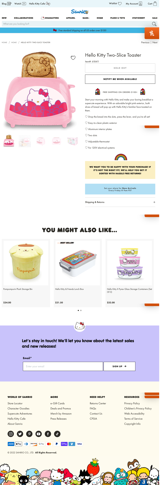
 

## Toegankelijkheidstest 1/2 (week 1)

  
uitwerken na test in 1e werkgroep

  ### Bevindingen
  Lijst met je bevindingen die in de test naar voren kwamen:

  #### Screenreader
  De screenreader ging erg goed er waren 2 fouten die vervelend was. Alle afbeeldingen hadden geen naam. De afbeelding werd niet omschreven er werrd gezegd "afbeelding"

  Dit kan ik in de html bij "alt" oplossen door een duidelijke naam aan de afbeelding te geven.

  Nog een probleem was dat de screenreader vakjes opnoemde die niet zichtbaar waren op de site waardoor je op een gegeven moment steeds vast liep.

  Dit ga ik oplossen door geen onnodigen vakken toetevoegen en veel testen of hij dit  niet uit zich zelf doet. Ik wil duidelijk aangeven wat alles is en waarvoor het staat.

  #### Muis en Toetsenbord 
  Hoe doet het best goed sommige onderdelen slaat hij over. Vaak is het onduidelijk waar ik op het moment ben en kan ik het moeilijk terugvinden. Zelf wil ik de focus kleur aanpassen (zo mogelijk) en zorgen dat de tab alles meepakt.

  #### Motoriek (shocks, elastiekjes)
De shocks deden bij persoonlijk erg pijn daardoor heb ik deze niet kunnen testen. Met de opdracht van de elastiekjes ging best veel goed soms klikte ik op verkeerde knoppen dit komt omdat sommige teksten en knoppen op de site erg klein zijn. dit wil ik graag aanpassen (groter maken) 

  #### Visueel (brillen, contrast, kleurenblind, dark/light). 
Mijn website heeft geen darkmode dit zal ik dus zelf moeten toevoegen. Voor de opdracht "kleurenblind" heb ik de kleuren op verschillende standen gezet en grijs. Alles was nog goed leesbaar en duidelijk. Met de brillen opdracht merkte ik dat sommige teksten erg klein was waardoor je ze echt niet kon lezen. Bijvoorbeeld bij product informatie. Op de zelfde pagina is er ook een geel blok met een quote erin. De tekst is erg dik waardoor het moeilijk leesbaar is.

## Breakdownschets (week 1)

  
uitwerken na afloop 2e werkgroep

  ### de hele pagina: 
 
  Ik heb voor mij zelf een paar onderdelen in de pagina geschetst en erbij geschreven met welke elemeten ik dit zou kunnen doen.

  
  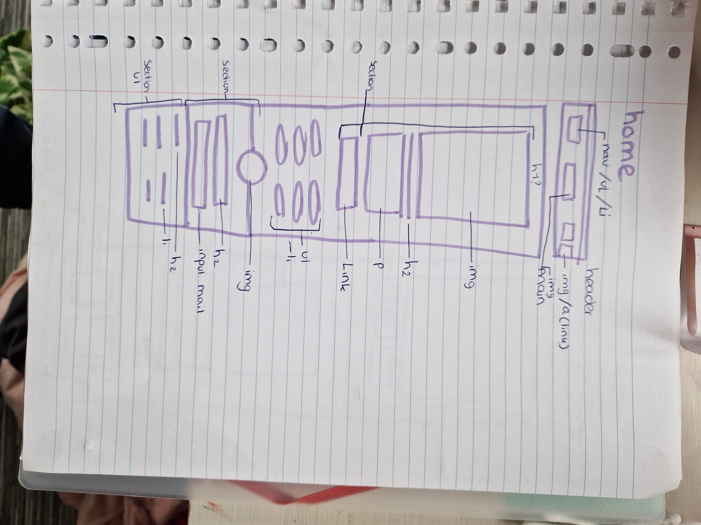

  ### dynamisch deel: 
  De sanrio pagina heeft een carousel gebruikt om de teksten een voor een te laten verschijnen. Dit wil ik ook gaan doen alleen dan met keyframes (animatie).

  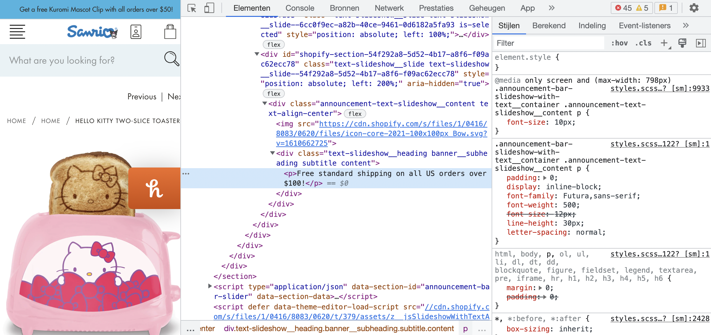

## Voortgang 1 (week 2)

  
uitwerken voor 1e voortgang

  ### Stand van zaken
  Ik wil graag mijn html laten checken. Ik weet niet of ik op de goede plekken een list heb gebruikt. Ook wil ik weten hoe je de screenreader de section laat voorlezen met een goede titel.

  ### Agenda voor meeting
  samen met je groepje opstellen

- html laten checken. Ook heb ik een vraag over mijn menu hoe ik hem sticky laat maken (lukt niet)
- Is alles semantisch corrent?

  ### Verslag van meeting
  hier na afloop snel de uitkomsten van de meeting vastleggen

  - Hoe moet ik een input op de goede manier maken
  - Ik heb geleerd over aria labels
  - Boven in mijn pagina zaten nog wat fouten opgelost
  - decoratieve afbeeldingen moet je in je css zetten niet in je html
  - geleerd hoeveel px de schermen moeten zijn (minimaal) voor deze opdracht

## Voortgang 2 (week 3)

  
uitwerken voor 2e voortgang

  ### Stand van zaken  
  Het lukte mij niet om de afbeeldingen in mijn css te zetten. op dit moment heb ik geen verdere vragen en zal ik verder van de rest meer te horen krijgen waar ik ook wat aan heb.

  ### Agenda voor meeting
  samen met je groepje opstellen
- wanneer mag je wel classes gebruiken?
- psuedo elementen
- hoe stijl ik forms?
- elementen dat verschuiven als je scrolt, dit wil ik niet.
- hamburger menu werkt niet hoe los ik dit op?

  ### Verslag van meeting
  hier na afloop snel de uitkomsten van de meeting vastleggen

  - De afbeeldingen responsive laten maken
  - Opfrisser hoe ik de afbeeldingen als achtergrond afbeelding maak in css

## Toegankelijkheidstest 2/2 (week 4)

  
uitwerken na test in 8e werkgroep

  ### Bevindingen
 - bepaalde teksen zijn nog iets te klein om goed te kunnen lezen

  #### Screenreader
Dit gaat erg goed. Hij pakt alles en er zitten goede namen aan je section zo weet ik waar ik ben. Hij slaat niets over.

  #### Muis en Toetsenbord 
op een gegeven moment is hij de focus kwijt je moet een paar keer doorklikken voordat hij weer te zie is in de input. Dit komt omdat hij de hele nav eerst afgaat die op dit moment verborgen is in het hamburger menu. Vanaf 800px zijn alle knoppen beschikbaar en gaat goed.

(Ik hoefde de hamburger menu niet perse optelossen)

  #### Motoriek (shocks, elastiekjes)
Elastiekjes - gaat erg goed de knoppen zijn groot genoeg dus het is erg makkelijk

  #### Visueel (brillen, contrast, kleurenblind, dark/light). 
Central field loss- Tekst in het plaatje onder je nav misschien iets meer naar rechts verplaatsen omdat je die iets minder ziet. Hetzelfde geldt voor de tekst bij je footer

Blur/glare- tekst met dunne font kan je niet heel goed lezen (de P onder je menubalk) Tekst in de footer helemaal niet. 

Glaucoma - moest wel moeite doen om het te lezen maar dat ligt gewoon aan deze aandoening 

Low contrast - gaat goed 

Combined loss diabetic eye disease - gaat goed 

Wazig zicht - tekst is goed te lezen misschien de font die dunner is iets minder.

Protanopie- alles blijft er mooi en duidelijk uit zien

Deuteranopie- werkt goed 
Tritanopie - werkt goed 
Achromatopsie - alles is goed leesbaar vanwege de kleur contrasten op je site

## Voortgang 3 (week 4)

  
uitwerken voor 3e voortgang

ik liep een beetje vast met een javascript onderdeel. Een onderdeel deed het maar en ik wou meerdere afbeeldingen veranderen wanneer ik erop klik. Ik kan dit wel oplossen met een div maar dit wil ik zo min mogelijk.

  ### Agenda voor meeting
Samen met mijn groepje:
- 1 animatie in javascript doet het, de rest niet hoe moet ik dat       oplossen? zoals een like button.
- Object observer api werkt niet.
- Hoe maak ik een tabel?
- Carrousel begint op helft van pagina doordat ik een grid heb op mijn pagine.
- Er zijn bepaalde plekken waar ik een class wil gebruiken mag dit?
- Er is een bepaalde lijn die ik weg wil hebben op mijn image, hoe doe ik dat.

  ### Verslag van meeting
  hier na afloop snel de uitkomsten van de meeting vastleggen

- Mijn persoonlijke vraag over javascript is gelukt
- Uit deze meeting heb ik waargenomen dat ik beter naar mijn site moet kijken en wat ik hier aan goed vind zodat ik dit kan vertellen in mijn mondeling
- Ik weet hoe ik mijn carousel kan laten beginnen en eindigen waar ik wil
- We hebben belangrijke onderdelen doorgenomen die in je site moeten zitten en waar wij op moeten letten wat wel en niet mag.

## Eindgesprek (week 5)

  
uitwerken voor eindgesprek

  Ik heb de site van Sanrio gemaakt, mijn site is responsive en toegangelijk. De echt sanrio site had maar 2 breedtes ik heb hiervan 3 gemaakt. Tijdens de 1e en 2de test ben ik met mijn maatje een paar onhandige dingen tegengekomen zoals:
  - tekst is te klein
  - doorzichtige onderdelen die mee worden genomen tijden het tabben door de pagina
  - geen goede uitleg bij afbdeeldingen/ sections
  - sommige teksten zijn net te dik waardoor het niet leesbaar is
  etc (staat bij mijn testen beter omschreven)

  Deze onderdelen heb ik mijn gemaakte website aangepast.

  ### Je uitkomst - karakteristiek screenshots:
  Ik vind zelf de like button met geluid erg leuk
  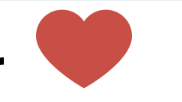

  De tekst animatie, ik moest goed uitzoeken hoe ik dit ging doen. Leuk dat het grotendeels gelukt is
  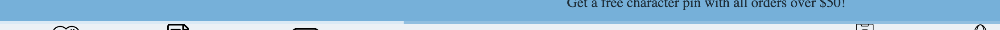

  Door de scrollbare hover producten waar je door heen kan gaan vind ik het al meer op een producten pagina lijken.
  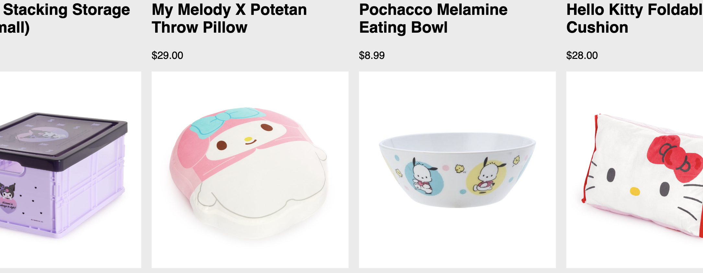

  ### Mijn pagina:

  link naar mijn pagina:

  file:///Users/milabigini/Desktop/web/index.html

  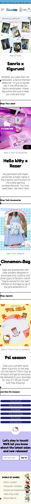
  

  file:///Users/milabigini/Desktop/web/koop.html

  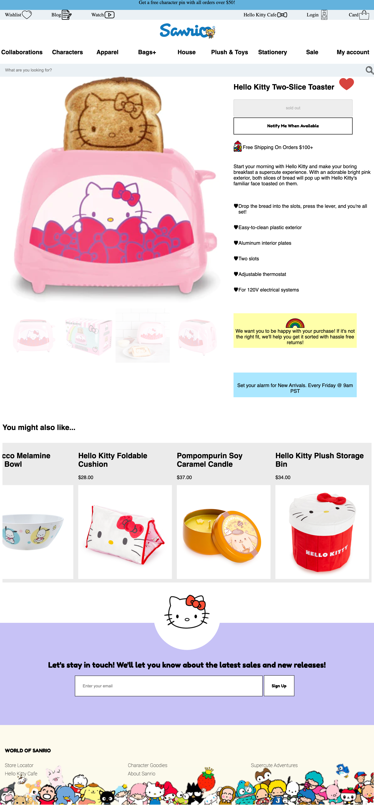
  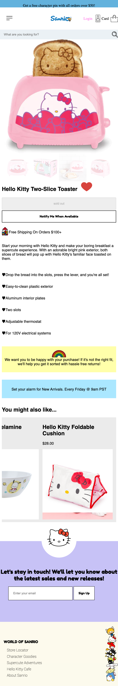

  Mijn pagina is responsive, heeft dark/light mode, heeft animatie, alle 5 button states, 2 micro interacties, heeft een formulier, z-index en geluid bij de like button.

  wanneer je op house klikt gaat het naar de koop pagina (2de pagina), om terug te gaan kunt u op het logo klikken.

  ### Dit ging goed/Heb ik geleerd: 
  ik heb geleerd hoe ik op een snelle manier een pagina indeling kan maken met grid.
  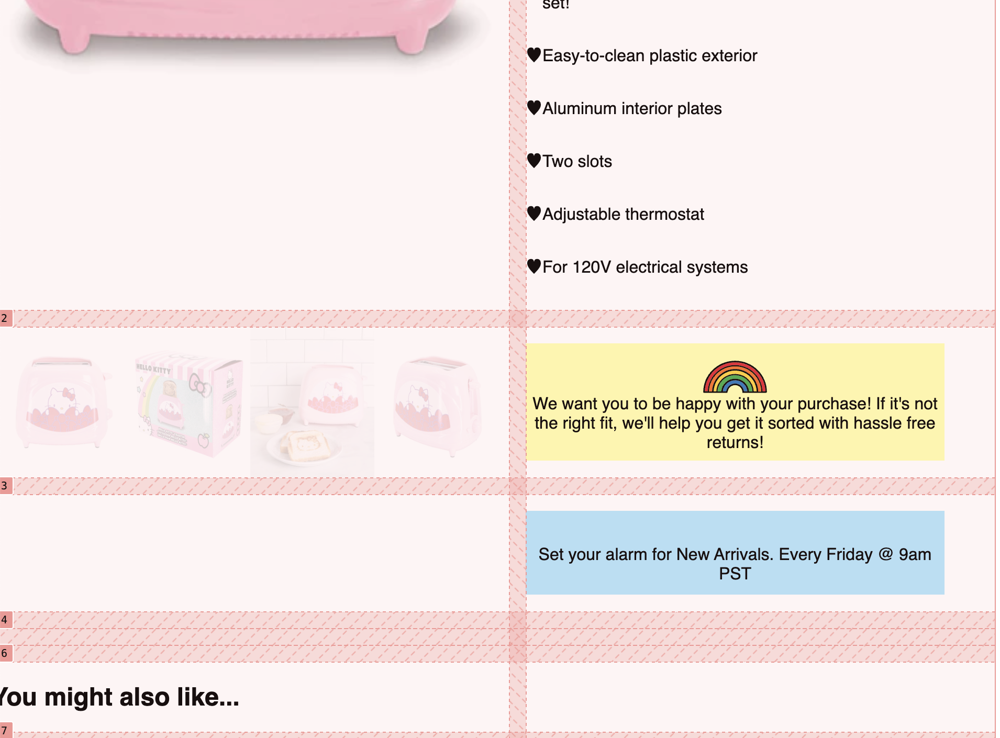
  Ik heb geleerd wat z-index inhoud, geleerd over keyframes met animatie en geleerd over toegangelijkheid waar je op moet letten in je html, hoe je bepaalde buttons kan stijlen en hoe je dit kan checken via je laptop.

  Ik heb geleerd hoe je een site responsive kan maken (en dus met media werken)

  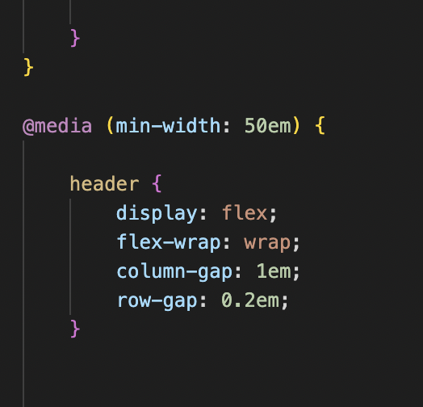

  ### Dit was lastig/Is niet gelukt:
  Het lukte mij niet om een pop up te maken, ik heb meerdere filmpjes bekeken, internet gezocht en gekeken in mijn oude js code. Maar helaas lukte mij het niet meer.
  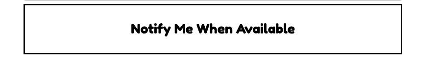

## Bronnenlijst

  
continu bijhouden terwijl je werkt

  Nb. Wees specifiek ('css-tricks' als bron is bijv. niet specifiek genoeg).

  1. Een paar onderdelen van mijn javascript in youtube filmpjes overgenomen helaas kon ik niet terug vinden welke.
  2. (nth-of-type/child. Ik heb geleerd hoe meerder onderdelen kan selecteren en vanaf of tot waar) https://css-tricks.com/useful-nth-child-recipies/
  3. (animatie kleine onderdelen van keyframes eruit gehaald) https://codepen.io/shooft/pen/KKorGPa
  4. (column gap geoefend, zo begreep ik beter hoe het werkte.) https://developer.mozilla.org/en-US/docs/Web/CSS/column-gap
  5. (Javascript let element) https://developer.mozilla.org/en-US/docs/Web/JavaScript/Reference/Statements/let
  6. De hamburgermenu heb ik meegeschreven in de les.

